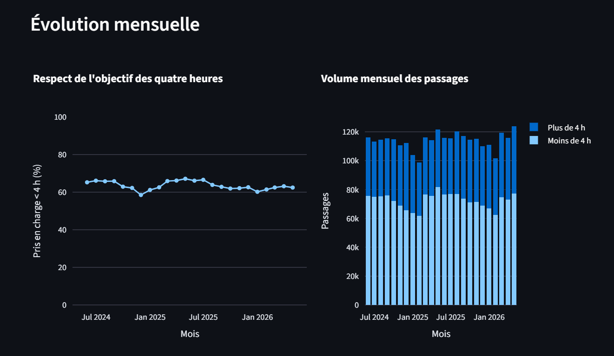
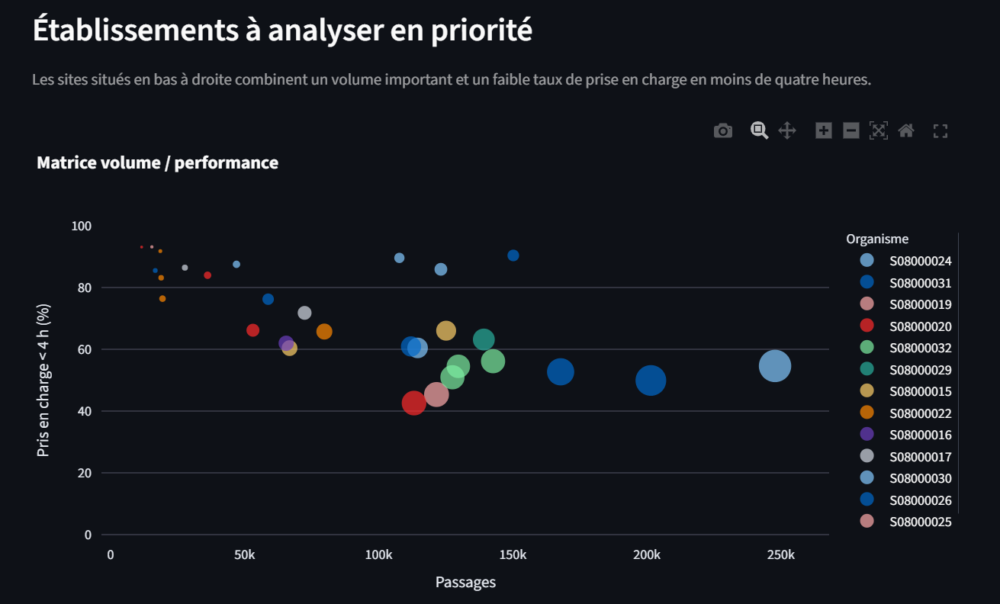
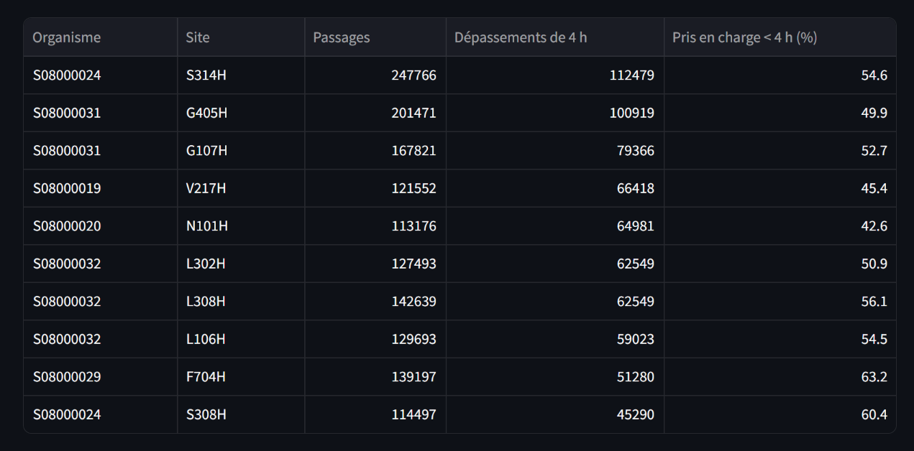

# Emergency Department Waiting Time Analytics

> Analyse des temps d'attente aux urgences afin d'identifier les périodes et les établissements nécessitant une attention prioritaire.


## Problématique

Les services d'urgence doivent absorber des volumes de patients variables tout en respectant des objectifs de délai de prise en charge.

Lorsque les données d'activité sont dispersées, il devient difficile d'identifier rapidement :

- les établissements où les attentes sont les plus importantes ;
- les périodes de forte tension ;
- les services qui respectent le moins l'objectif des quatre heures ;
- les situations à analyser en priorité.

## Objectif

Construire un pipeline de données et un tableau de bord permettant de répondre à la question suivante :

> **Quels établissements et quelles périodes combinent un volume élevé de passages aux urgences et un faible respect de l'objectif de prise en charge en moins de quatre heures ?**

La solution aide à détecter les tensions et à prioriser les analyses. Elle ne prétend pas expliquer à elle seule les causes des attentes ni remplacer une décision opérationnelle.

## Données

Le projet utilise les données publiques mensuelles **Accident & Emergency Activity and Waiting Times** de NHS Scotland.

- 39 583 observations ;
- 103 sites hospitaliers ;
- 14 organismes hospitaliers ;
- période couverte : juillet 2007 à mai 2026 ;
- services d'urgence de type 1 et de type 3 ;
- passages planifiés et non planifiés ;
- dépassements de 4, 8 et 12 heures.

Source : [NHS Scotland Open Data](https://www.opendata.nhs.scot/dataset/997acaa5-afe0-49d9-b333-dcf84584603d)

### Périmètre principal

L'analyse principale porte sur :

- les passages **non planifiés** ;
- les services d'urgence principaux **Type 1** ;
- une granularité mensuelle ;
- le respect de l'objectif de prise en charge en moins de quatre heures.

Ce périmètre évite les doubles comptes et permet une comparaison cohérente entre les sites.
Après filtrage et regroupement, le fichier analytique contient 7 023 observations sur 35 sites.

## Indicateurs suivis

- nombre total de passages aux urgences ;
- nombre de prises en charge en moins de quatre heures ;
- nombre de passages dépassant 4, 8 et 12 heures ;
- taux pondéré de prise en charge en moins de quatre heures ;
- évolution mensuelle de la performance ;
- classement des sites par volume et taux de conformité ;
- identification des sites à fort volume et faible performance.

## Premier constat métier

Entre juin 2025 et mai 2026, pour les passages non planifiés dans les urgences de type 1 :

| Indicateur | Résultat |
| --- | ---: |
| Passages enregistrés | 1 380 136 |
| Pris en charge en moins de 4 heures | 63,0 % |
| Passages dépassant 4 heures | 510 592 |
| Taux observé en mai 2026 | 62,4 % |

Ces chiffres montrent l'intérêt d'un outil de pilotage permettant de localiser les tensions et de suivre leur évolution.

## Architecture

```text
NHS Scotland Open Data
          |
          v
Nettoyage et normalisation Python
          |
          v
      PostgreSQL
          |
          v
  Dashboard Streamlit
          |
          v
Identification des sites et périodes prioritaires
```

## Fonctionnalités du dashboard

- filtres par période, organisme hospitalier et site ;
- évolution mensuelle du respect de l'objectif des quatre heures ;
- calcul pondéré du taux à partir des volumes réels ;
- comparaison des établissements ;
- classement des sites selon leur volume et leur performance.

## Aperçu du dashboard








## Interprétation des résultats

Avec les filtres proposés par défaut, l'analyse couvre la période de **juin 2024 à mai 2026** pour l'ensemble des organismes et des sites disponibles.

### Une performance globale sous tension

Sur 2 731 341 passages, 63,6 % des patients sont pris en charge en moins de quatre heures. Les données comptabilisent 994 248 dépassements de quatre heures, dont 355 750 dépassent huit heures et 157 692 dépassent douze heures. Les catégories de huit et douze heures sont incluses dans les dépassements de quatre heures et ne doivent donc pas être additionnées entre elles.

### Une dégradation entre le début et la fin de la période

| Mois | Passages | Dépassements de 4 h | Pris en charge < 4 h |
| --- | ---: | ---: | ---: |
| Juin 2024 | 116 057 | 40 350 | 65,2 % |
| Mai 2026 | 123 755 | 46 478 | 62,4 % |

Le volume augmente de 6,6 %, tandis que le taux de prise en charge en moins de quatre heures diminue de 2,8 points. Le meilleur résultat mensuel est observé en mai 2025 avec 67,1 %. Décembre 2024 constitue le mois le plus dégradé avec 58,5 % et 46 538 dépassements. Cette observation peut signaler une pression saisonnière, mais les données agrégées ne permettent pas d'en établir la cause.

### Des difficultés concentrées sur quelques sites

Le tableau est classé selon le **nombre absolu de dépassements de quatre heures**. Les dix premiers sites concentrent 704 854 dépassements, soit 70,9 % du total observé. S314H porte la charge la plus importante avec 112 479 dépassements, tandis que N101H présente le taux de prise en charge en moins de quatre heures le plus faible du groupe, à 42,6 %.

Le volume ne suffit cependant pas à expliquer la performance. G513H prend en charge 90,4 % de ses patients en moins de quatre heures malgré 150 183 passages, alors que G405H atteint seulement 49,9 % pour 201 471 passages. Ces écarts justifient une analyse complémentaire des pratiques et des contraintes locales.

### Comment lire la priorité

La matrice et le tableau sont complémentaires :

- la matrice repère les sites combinant un volume important et un faible taux de prise en charge en moins de quatre heures ;
- la taille des bulles représente le nombre de dépassements de quatre heures ;
- le tableau fournit le classement exact des sites selon la charge totale de retards.

Un site à fort volume n'est donc pas automatiquement peu performant. La priorité doit être évaluée en croisant le volume, le nombre de dépassements et le taux de prise en charge en moins de quatre heures. Enfin, ces résultats servent à détecter les tensions, mais ne permettent pas d'en déterminer les causes sans données supplémentaires sur les effectifs, les lits, la gravité clinique ou l'organisation locale.

## Technologies

| Domaine | Technologies |
| --- | --- |
| Traitement des données | Python, pandas |
| Base de données | PostgreSQL |
| Visualisation | Streamlit, Plotly |
| Conteneurisation | Docker, Docker Compose |
| Qualité | unittest |

## Structure utile

```text
hospital-waiting-time-analytics/
|-- data/
|   `-- raw/nhs_scotland/
|-- etl/
|   |-- extract/
|   |-- transform/
|   `-- load/
|-- dashboard/
|   `-- streamlit_app.py
|-- tests/
|-- docker-compose.yml
|-- Dockerfile
|-- requirements.txt
`-- README.md
```

## Démarrage rapide avec Docker

La configuration par défaut suffit pour un usage local. Pour la personnaliser :

```bash
cp .env.example .env
```

Sous Windows PowerShell, utilisez `Copy-Item .env.example .env`. Modifiez ensuite les
variables `POSTGRES_DB`, `POSTGRES_USER` et `POSTGRES_PASSWORD` dans `.env`.

```bash
docker compose up --build
```

Cette commande télécharge les données, les transforme, les charge dans PostgreSQL, puis démarre le dashboard sur :

```text
http://localhost:8501
```

Les identifiants PostgreSQL par défaut sont réservés au développement local. Pour arrêter
les services, utilisez `docker compose down` ; ajoutez `--volumes` uniquement si vous
souhaitez aussi supprimer la base locale.

## Installation manuelle

### 1. Cloner le dépôt

```bash
git clone https://github.com/mila1515/hospital-waiting-time-analytics.git
cd hospital-waiting-time-analytics
```

### 2. Créer l'environnement Python

```bash
python -m venv venv
```

Sous Windows PowerShell :
```powershell
.\venv\Scripts\Activate.ps1
```

Sous Linux ou macOS :

```bash
source venv/bin/activate
```

### 3. Installer les dépendances

```bash
pip install -r requirements.txt
```

### 4. Télécharger les données

```bash
python etl/extract/download_waiting_times.py
```

### 5. Transformer les données

```bash
python etl/transform/transform_waiting_times.py
```

Le fichier analytique est enregistré dans `data/processed/waiting_times_processed.csv`.

À ce stade, le dashboard peut déjà fonctionner en mode local directement depuis ce CSV :

```bash
streamlit run dashboard/streamlit_app.py
```

PostgreSQL reste disponible pour démontrer le chargement et l'utilisation d'une base de données.

### 6. Démarrer PostgreSQL

```bash
docker compose up -d db
```

### 7. Charger les données

```bash
python etl/load/load_waiting_times_to_postgres.py --host localhost --port 5433 --db hospital --user postgres --password postgres
```

### 8. Lancer le dashboard

Sous Windows PowerShell :

```powershell
$env:PGHOST="localhost"
$env:PGPORT="5433"
$env:PGDATABASE="hospital"
$env:PGUSER="postgres"
$env:PGPASSWORD="postgres"
streamlit run dashboard/streamlit_app.py
```

## Limites

Les données sont mensuelles et agrégées. Elles ne contiennent pas :

- les temps d'attente individuels ;
- les horaires d'arrivée ;
- les effectifs médicaux disponibles ;
- le nombre de lits disponibles ;
- la gravité clinique des patients ;
- les causes opérationnelles des retards.

Le projet permet donc de **détecter et prioriser les situations problématiques**, mais pas d'établir une causalité ni de recommander automatiquement un niveau précis de personnel.

## Évolutions possibles

- créer des alertes lorsque le taux passe sous un seuil défini ;
- prévoir le taux du mois suivant à partir de l'historique ;
- intégrer des données de personnel, de lits et d'occupation afin d'étudier les causes des attentes.

## Avertissement

Ce projet est un démonstrateur analytique réalisé à partir de données publiques agrégées. Il ne constitue pas un dispositif médical et ne doit pas être utilisé seul pour prendre des décisions cliniques ou opérationnelles.

## Autrice

**Djamila** — Data Analyst · Business Intelligence · Intelligence Artificielle
